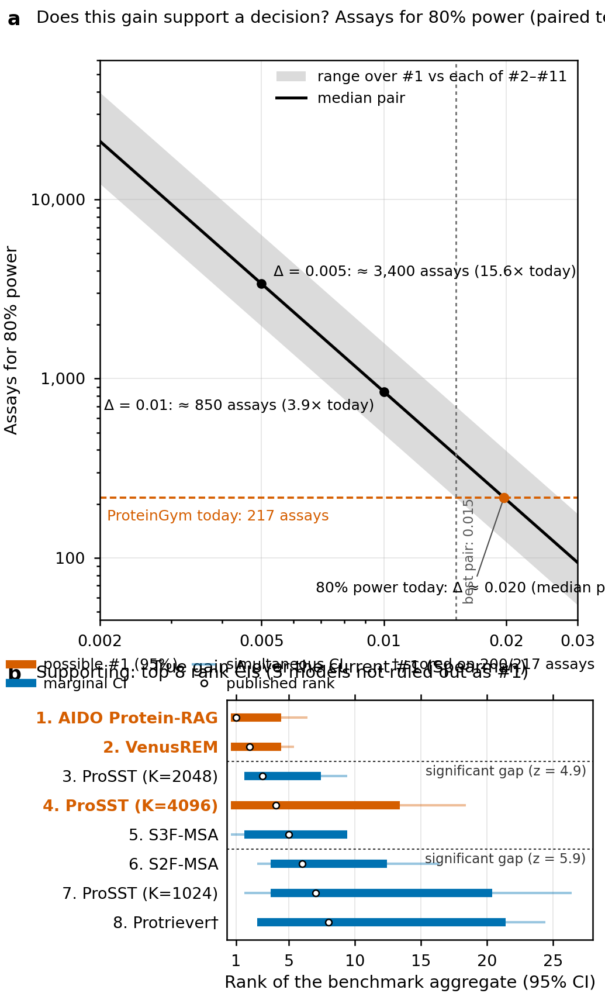

# Can ProteinGym scores support a model decision?

**Power, rank uncertainty and assay-design sensitivity on the zero-shot DMS substitution benchmark**

Nissan Dutta. Technical note, draft of October 2026. Code and data provenance:
<https://cursor.com/codebase/nissandutta/genesis>.
The LaTeX version (`paper/technical-note.tex`) compiles to the 2-page PDF. Every number below is generated from
`results/summary.json`; [`numbers.md`](numbers.md) maps each one to its source.

Decisions about AI models in biology rest on evaluation scores. On the field's main public protein benchmark, the
smallest gain the leaderboard can reliably detect at the top is about 0.015 (80% power), larger than the gap between
the published #1 and #2 and comparable to the gap to #3. Which model ranks #1 also depends on which kinds of lab tests
are counted—a design choice, not a property of the models. This note asks how large an evaluation must be before its
numbers can support a decision, and what that decision could reasonably be.

**Summary.** On ProteinGym commit `144fe22` (97 models, 217 assays), a paired power analysis suggests today's
benchmark could support claims only about gains of roughly 0.020 Spearman or more over the leader (0.015–0.027 across
the top ten pairs); a 0.01 gain would need about 850 assays (3.9× today). Marginal and simultaneous rank intervals
indicate three models cannot be ruled out as #1, and only 2 of 19 adjacent top-20 pairs differ significantly. Leaving
out function groups or re-ranking on shared assays changes the #1 slot. We treat high leaderboard scores as a
*hypothesis* that a model may be preferable for mutation-effect prediction; this work does not assess dangerous
capabilities.

**Figure 1.** **(a)** Assays needed for 80% power to detect a true gain Δ over the current #1 (band: #1 vs each of the
next ten models). Today's 217 assays are marked; the median detectable gain is about 0.020 and the best pair about
0.015. **(b)** Supporting rank intervals for the top eight models (marginal thick, simultaneous thin). Orange: models
not ruled out as #1. Generated by `pgnoise figure`.

## 1. Question

ProteinGym [1] orders zero-shot models by a function-group-balanced mean Spearman correlation and reports bootstrap
standard errors of each model's gap to #1, not uncertainty for ranks. Neuhof and Benjamini [2] give rank intervals for
general ML leaderboards (TabArena, MMLU); we apply that style of max-t rank inference and power analysis to ProteinGym's
nested assay structure. Woolley et al. [4] warn that ProteinGym aggregates can hide dataset-level variance; Livesey and
Marsh [5, 6] bootstrap rank significance on their own DMS benchmarks. To our knowledge, this is the first analysis to
place simultaneous confidence intervals on model ranks in the ProteinGym DMS substitution leaderboard and to quantify
its statistical power and sensitivity to assay subsets and aggregation; ProteinGym currently reports only bootstrap
standard errors of each model's gap to the top-ranked model. We do not claim the first rank intervals ever [2, 8].

## 2. Data and version

Commit `144fe22` (25 March 2026): v1.3 plus AIDO Protein-RAG and Protriever, 97 models, 217 assays, 200
(UniProt, function) units. We reproduce all 97/97 published averages and ranks; 91/97 bootstrap SEs match at 3 dp.
We report overall leaderboard statistics only and do not stratify by organism or viral proteins, as a biosecurity-adjacent
judgment rather than a data limitation.

## 3. Methods

**Estimand.** Intervals target the rank of each model's *benchmark aggregate* (limit of infinitely many units per
function group), not Neuhof and Benjamini's prediction interval for rank on a new assay [2]. **Bootstrap:** stratified
within function groups ($B$ = 10,000), as ProteinGym. **Rank intervals:** pairwise max-t (marginal single-step and
simultaneous step-down) following Mogstad et al. [3]; 95% best-model set. **Power:** paired differences between #1 and
each of the next ten complete-coverage models; $n = n_0 [(z_{0.975}+z_{0.8}) \widehat{se}_0/\Delta]^2$ for 80% power
[11, 12]. **Shared assays:** re-score every model on (i) the 200 assays every model shares and (ii) the intersection of
assays scored by the published top 10 ($K=10$; here identical to (i)). **Coverage simulation:** five scenarios, 1,000
replicates each, as in the repository.

## 4. Results

**Power and detectable gains (Fig. 1a).** With 80% power at today's size, the median minimum detectable difference
(MDD) over #1 vs the next ten models is about 0.020 (range 0.015–0.027). The smallest pair (AIDO Protein-RAG vs
VenusREM) has MDD about 0.015—larger than their 0.00004 gap and than the 0.011 gap to #3. Detecting Δ = 0.01 would
need about 850 assays (3.9× today); Δ = 0.005 about 3,380 (15.6×). We phrase “this gap supports a decision” as a
testable hypothesis at a stated Δ, not as a verdict on who is #1.

**(A) Statistical uncertainty at the top (Fig. 1b).** AIDO Protein-RAG and VenusREM each lead in about half of
bootstrap replicates (49% and 50% for the top two). The 95% best-model set is AIDO Protein-RAG, VenusREM and
ProSST (K=4096). Only 2/19 adjacent
top-20 pairs differ significantly (VenusREM > ProSST (K=2048), S3F-MSA > S2F-MSA). Marginal single-step intervals
keep worst-model coverage at least 0.973 in simulation (simultaneous step-down at least 0.994); naive bootstrap rank
intervals fall to 0.081 under exact ties.

**(B) Averaging and assay mix (design dependence).** Dropping Activity or OrganismalFitness makes VenusREM #1. On the
200 assays every model shares, #1 is VenusREM (not AIDO Protein-RAG on all 217); the possible-#1 set is unchanged in
membership but order shifts (Table 2). NDCG and top-K recall reorder the leaderboard more sharply (Kendall τ ≈ 0.65–0.70
vs published). Protriever (#8 on all assays) falls to #10 on shared assays; its 17 missing assays are harder on average
for other models (mean Spearman 0.379 on missing vs 0.410 on common).

**Table 2.** Leaderboard on the full benchmark vs shared-assay subsets (`results/tables/shared_assay_rerank.csv`).

| Subset | Assays | #1 | Possible #1s (95% set) |
|---|---|---|---|
| Published (all assays) | 217 | AIDO Protein-RAG | AIDO Protein-RAG, VenusREM and ProSST (K=4096) |
| All models scored | 200 | VenusREM | ProSST (K=4096), VenusREM and AIDO Protein-RAG |
| Published top 10 scored | 200 | VenusREM | ProSST (K=4096), VenusREM and AIDO Protein-RAG |

**Replication.** ESM-2 re-scoring of five assays reproduces published Spearman at 3 dp; per-assay noise does not
explain leaderboard-wide rank uncertainty.

## 5. Limitations

Intervals omit mutant-level noise and scoring randomness. Power assumes future assays resemble today's mix. High
mutation-effect scores are not evidence about misuse potential. Protriever's missing assays are unconfirmed processing
gaps. Literature search 6 October 2026.

## References

1. Notin et al., ProteinGym, NeurIPS D&B 2023.
2. Neuhof & Benjamini, arXiv:2606.08679, 2026.
3. Mogstad et al., *Rev. Econ. Stud.* 2024.
4. Woolley et al., bioRxiv 2026.06.04.730121, 2026.
5–6. Livesey & Marsh, *Mol. Syst. Biol.* 2023; *Genome Biology* 2025.
7–20. As in `paper/refs.bib`.
